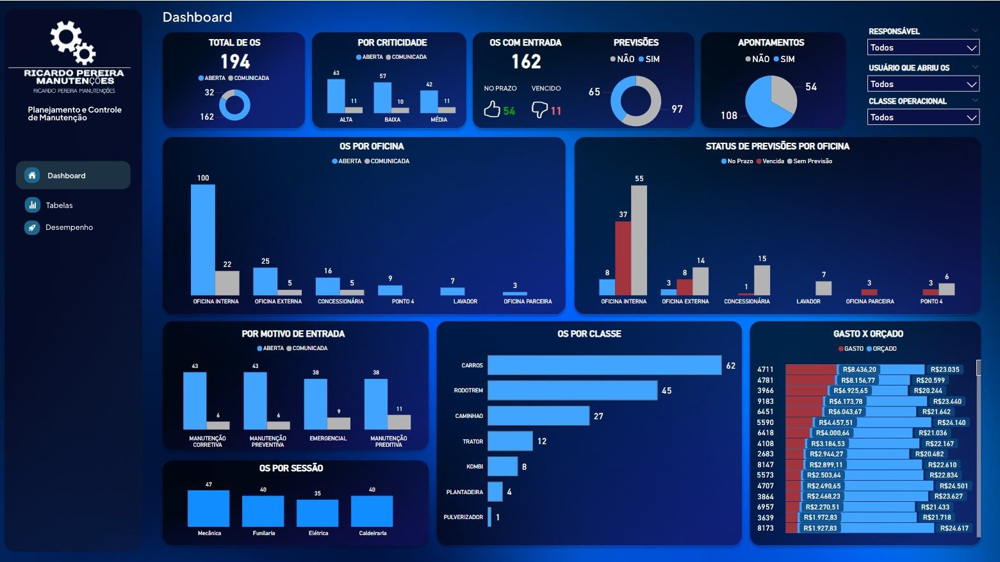
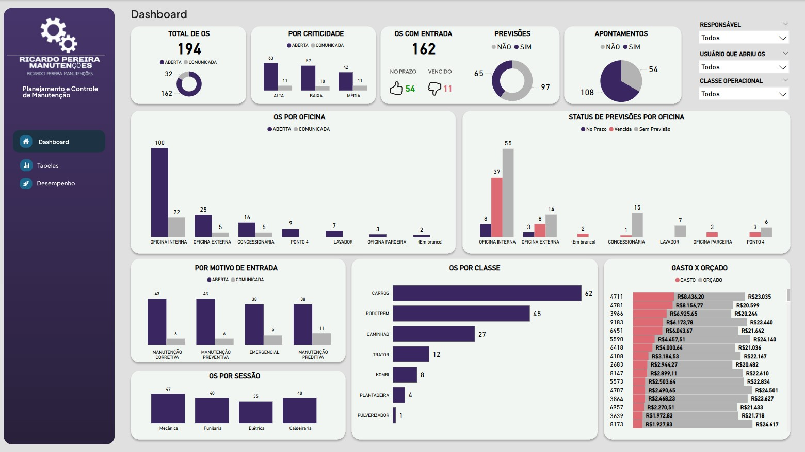
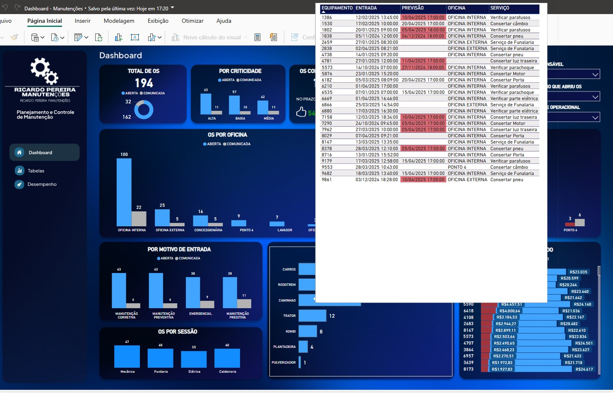

## DashBoard: Manutenção 

Gostaria de compartilhar com vocês mais um dashboard desenvolvido no Power BI, utilizando dados fictícios — mas totalmente aplicável a qualquer empresa da área de manutenção.

Foram criados dois modelos visuais: um com tema dark e outro com tema white, para atender diferentes preferências de visualização.

Etapas do projeto:

- Definição dos indicadores chave (KPIs) a serem analisados

- Tratamento e modelagem dos dados no Power Query

- Criação de relacionamentos entre as tabelas

- Desenvolvimento de medidas DAX para cálculos avançados

- Construção de visuais interativos e dinâmicos

